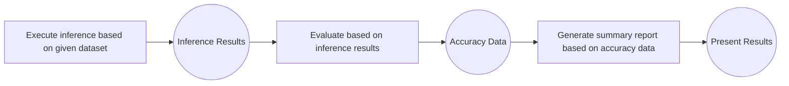
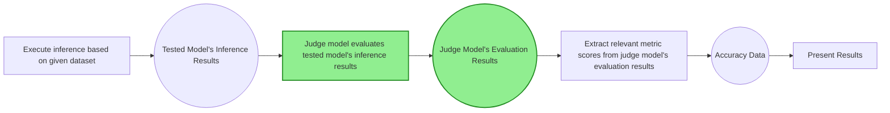
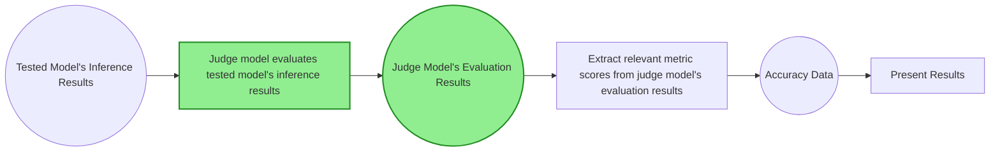
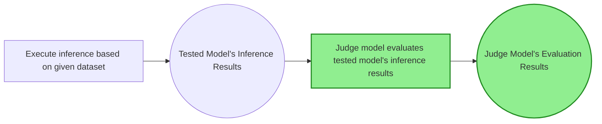
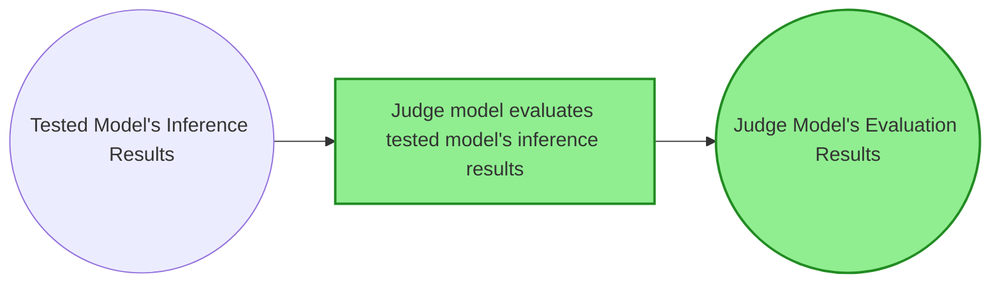

# Evaluation Using Judge Model

## Why Use Judge Model for Evaluation

In conventional evaluation tasks, the process of evaluating model inference results typically involves extracting answers from inference results using methods like regular expressions, comparing them with ground truth answers, and determining whether the model's inference results are correct, ultimately calculating a total score. The overall process is as follows:



However, some evaluation scenarios have no ground truth answer, or require not only determining whether the answer is correct but also evaluating whether the reasoning process is sound. In such cases, conventional answer extraction methods cannot meet these requirements, so it is necessary to introduce a judge model to evaluate the tested model's inference results. The overall evaluation process with judge model intervention is as follows:



## Quick Start

Taking the aime2025 dataset evaluation as an example, the usage is basically consistent with [AISBench Quick Start](https://ais-bench-benchmark-rf.readthedocs.io/en/latest/get_started/quick_start.html#). This quick start section only covers the differences.

### Command Meaning

In the AISBench command, specify the judge model dataset task `aime2025_gen_0_shot_llmjudge` through `--datasets`.

```shell
ais_bench --models vllm_api_general_chat --datasets aime2025_gen_0_shot_llmjudge
```

> Note: Judge model dataset tasks differ from regular dataset tasks in configuration, but both types of dataset tasks can be mixed in a single dataset task.

### Task Meaning Query (Optional)

Same as Quick Start, not repeated here.

### Pre-run Preparation

- `--models`: Using `vllm_api_general_chat` model task requires preparing an inference service that supports `v1/chat/completions` sub-service. You can refer to 🔗 [VLLM Launch OpenAI Compatible Server](https://docs.vllm.com.cn/en/latest/getting_started/quickstart.html#openai-compatible-server) to start the inference service (the tested model is one inference service, and the judge model is another inference service; for quick start, you can also share one service if convenient).
- `--datasets`: Using `aime2025_gen_0_shot_llmjudge` dataset task requires preparing the aime2025 dataset, which can be downloaded from 🔗 [aime2025 dataset archive provided by opencompass](http://opencompass.oss-cn-shanghai.aliyuncs.com/datasets/data/aime2025.zip). Deploy the extracted `aime2025/` folder to the `ais_bench/datasets` folder under the AISBench evaluation tool root path.

### Modify Task Configuration Files

Each model task, dataset task, and result presentation task corresponds to a configuration file. Before running the command, you need to modify the contents of these configuration files. The paths to these configuration files can be queried by adding `--search` to the original AISBench command, for example:

```shell
ais_bench --models vllm_api_general_chat --datasets aime2025_gen_0_shot_llmjudge --search
```

> ⚠️ **Note**: Executing the command with search will print the absolute paths of the task configuration files.

Executing the query command will produce the following results:

```shell
╒══════════════╤═══════════════════════════════════════╤════════════════════════════════════════════════════════════════════════════════════════════════════════════════════════════════╕
│ Task Type    │ Task Name                             │ Config File Path                                                                                                               │
╞══════════════╪═══════════════════════════════════════╪════════════════════════════════════════════════════════════════════════════════════════════════════════════════════════════════╡
│ --models     │ vllm_api_general_chat                 │ /your_workspace/benchmark/ais_bench/benchmark/configs/models/vllm_api/vllm_api_general_chat.py                                 │
├──────────────┼───────────────────────────────────────┼────────────────────────────────────────────────────────────────────────────────────────────────────────────────────────────────┤
│ --datasets   │ aime2025_gen_0_shot_llmjudge          │ /your_workspace/benchmark/ais_bench/benchmark/configs/datasets/aime2025/aime2025_gen_0_shot_llmjudge.py                        │
╘══════════════╧═══════════════════════════════════════╧════════════════════════════════════════════════════════════════════════════════════════════════════════════════════════════════╛

```

- The configuration method for `vllm_api_general_chat` corresponding to the tested model task configuration file is the same as in Quick Start, not repeated here.
- In the `aime2025_gen_0_shot_llmjudge` corresponding judge model dataset task configuration file, you need to modify the judge model configuration:
    ```python
            judge_model=dict(
                attr="service",
                type=VLLMCustomAPIChat,
                abbr="judge",  # abbr identifies the uniqueness of the judge model
                path="",                    # Specify the absolute path of the model serialization vocabulary file (generally not needed for accuracy test scenarios)
                model="",        # Specify the model name loaded on the server side, configure according to the actual model name pulled by the VLLM inference service (configuring an empty string will automatically obtain it)
                stream=False,
                request_rate=0,           # Request sending frequency, send 1 request per 1/request_rate seconds to the server, if less than 0.1, send all requests at once
                use_timestamp=False,      # Whether to schedule requests according to timestamp in the dataset, applicable to datasets containing timestamp (such as Mooncake Trace)
                retry=2,                  # Maximum retry times for each request
                api_key="",               # Custom API key, default is empty string
                host_ip="localhost",      # Specify the IP of the judge model inference service
                host_port=8080,           # Specify the port of the judge model inference service
                url="",                     # Custom URL path to access the judge model inference service (needs to be configured when the base url is not a combination of http://host_ip:host_port, after configuration host_ip and host_port will be ignored)
                max_out_len=512,          # Maximum number of tokens output by the inference service
                batch_size=1,               # Maximum concurrency of request sending
                trust_remote_code=False,    # Whether the tokenizer trusts remote code, default False;
                generation_kwargs=dict(   # Model inference parameters, refer to VLLM documentation for configuration, AISBench evaluation tool does not process, attached in the sent request
                    temperature=0.01,
                    ignore_eos=False,
                )
                pred_postprocessor=dict(type=extract_non_reasoning_content),
            ),
    ```
The meaning of judge model task configuration is exactly the same as the tested model task configuration.


### Execute Command

After modifying the configuration files, execute the command to start the service-based accuracy evaluation (based on judge model evaluation):

```bash
ais_bench --models vllm_api_general_chat --datasets aime2025_gen_0_shot_llmjudge
```

### View Task Execution Details

Full Process Progress Display

After executing the AISBench command, the status of the currently executing task will be displayed on a real-time refreshing dashboard in the command line (press "P" key on the keyboard to stop refreshing for copying dashboard information, press "P" again to continue refreshing), for example:

```shell
Base path of result&log : outputs/default/20260305_153318
Task Progress Table (Updated at: 2026-03-05 15:34:33)
Page: 1/1  Total 2 rows of data
Press Up/Down arrow to page, 'P' to PAUSE/RESUME screen refresh, 'Ctrl + C' to exit
+--------------------------------+-----------+---------------------------------------------------+-------------+----------+-----------------------------------------------+---------------------------------------------------+
| Task Name                      |   Process | Progress                                          | Time Cost   | Status   | Log Path                                      | Extend Parameters                                 |
+================================+===========+===================================================+=============+==========+===============================================+===================================================+
| vllm-api-general-chat/aime2025 |   2818438 | [##############################] 30/30 [2.0 it/s] | 0:00:12     | finish   | logs/infer/vllm-api-general-chat/aime2025.out | {'POST': 30, 'RECV': 30, 'FINISH': 30, 'FAIL': 0} |
+--------------------------------+-----------+---------------------------------------------------+-------------+----------+-----------------------------------------------+---------------------------------------------------+

```

Judge Model Inference Process:

```shell
Base path of result&log : outputs/default/20260305_153318
Task Progress Table (Updated at: 2026-03-05 15:34:33)
Page: 1/1  Total 2 rows of data
Press Up/Down arrow to page, 'P' to PAUSE/RESUME screen refresh, 'Ctrl + C' to exit

+--------------------------------------+-----------+---------------------------------------------------+-------------+----------+-----------------------------------------------------+---------------------------------------------------+
| Task Name                            |   Process | Progress                                          | Time Cost   | Status   | Log Path                                            | Extend Parameters                                 |
+======================================+===========+===================================================+=============+==========+=====================================================+===================================================+
| vllm-api-general-chat/aime2025-judge |   2821633 | [##############################] 30/30 [2.0 it/s] | 0:00:58     | finish   | logs/infer/vllm-api-general-chat/aime2025-judge.out | {'POST': 30, 'RECV': 30, 'FINISH': 30, 'FAIL': 0} |
+--------------------------------------+-----------+---------------------------------------------------+-------------+----------+-----------------------------------------------------+---------------------------------------------------+

```

Process of Extracting Answers from Judge Model Inference Results:

```shell
Base path of result&log : outputs/default/20260305_153318
Task Progress Table (Updated at: 2026-03-05 15:34:33)
Page: 1/1  Total 2 rows of data
Press Up/Down arrow to page, 'P' to PAUSE/RESUME screen refresh, 'Ctrl + C' to exit

+--------------------------------------+-----------+------------+-------------+----------+----------------------------------------------------+---------------------+
| Task Name                            |   Process | Progress   | Time Cost   | Status   | Log Path                                           | Extend Parameters   |
+======================================+===========+============+=============+==========+====================================================+=====================+
| vllm-api-general-chat/aime2025-judge |   2826026 | NA         | 0:00:00     | finish   | logs/eval/vllm-api-general-chat/aime2025-judge.out | None                |
+--------------------------------------+-----------+------------+-------------+----------+----------------------------------------------------+---------------------+

```

The task execution detail logs will be continuously written to the default output path, which is displayed on the real-time refreshing dashboard, i.e., `Log Path`. `Log Path` (`logs/infer/vllm-api-general-chat/aime2025.out`) is a path under `Base path` (`outputs/default/20260305_153318`). Taking the above dashboard information as an example, the detailed log paths for task execution are:

```shell
# {Base path}/{Log Path}
# Tested model inference process log
outputs/default/20260305_153318/logs/infer/vllm-api-general-chat/aime2025.out
# Judge model inference process log
outputs/default/20260305_153318/logs/infer/vllm-api-general-chat/aime2025-judge.out
# Process of extracting answers from judge model inference results log
outputs/default/20260305_153318/logs/eval/vllm-api-general-chat/aime2025-judge.out
```

> 💡 If you want to print detailed logs directly during execution, you can add `--debug` to the command:
`ais_bench --models vllm_api_general_chat --datasets aime2025_gen_0_shot_llmjudge --debug`


`Base path` (`outputs/default/20260305_153318`) contains all task execution details. After the command execution ends, all execution details are as follows:

```shell
20260305_153318/
├── configs # Configuration file synthesized from model task, dataset task, and result presentation task configurations
│   └── 20260305_153318_2833762.py
├── logs # Logs during execution, if --debug is added to the command, there will be no process logs written to disk (all printed directly)
│   ├── eval
│   │   └── vllm-api-general-chat
│   │       └── aime2025-judge.out # Log of the accuracy evaluation process based on judge model inference results under predictions/ folder
│   └── infer
│       └── vllm-api-general-chat
│           ├── aime2025-judge.out # Judge model inference results
│           └── aime2025.out # Tested model inference process log
├── predictions
│   └── vllm-api-general-chat
│       ├── aime2025.jsonl # Tested model inference results
│       └── aime2025-judge.jsonl # Judge model inference results (all outputs returned by the inference service)
├── results
│   └── vllm-api-general-chat
│       └── aime2025-judge.json # Raw scores calculated from accuracy evaluation
└── summary
    ├── summary_20260305_153318.csv # Final accuracy score presentation (table format)
    ├── summary_20260305_153318.md # Final accuracy score presentation (markdown format)
    └── summary_20260305_153318.txt # Final accuracy score presentation (text format)
```

> ⚠️ **Note**: Different evaluation scenarios have different task execution details written to disk. Please refer to the specific evaluation scenario guide for details.


### Output Results

The result display example is as follows:

```bash
| dataset | version | metric | mode | vllm-api-general-chat |
|----- | ----- | ----- | ----- | -----|
| aime2025-judge | 3fb7e8 | accuracy | gen | 100.00 |
```

## Other Accuracy Evaluation Function Scenarios

From the quick start section of the judge model, you can see that except for the additional need to modify the judge model configuration in the data configuration file, the other evaluation execution methods are exactly the same as the conventional evaluation execution methods. Therefore, the execution methods for other accuracy evaluation function scenarios are also exactly the same.

### Multi-task Evaluation

Refer to [Accuracy Evaluation Scenario Multi-task Evaluation](../base_tutorials/scenes_intro/accuracy_benchmark.md#multi-task-evaluation)

### Multi-task Parallel Evaluation

Refer to [Accuracy Evaluation Scenario Multi-task Parallel Evaluation](../base_tutorials/scenes_intro/accuracy_benchmark.md#multi-task-parallel-evaluation)

### Interrupted Evaluation & Failed Case Re-evaluation

Refer to [Accuracy Evaluation Scenario Interrupted Evaluation & Failed Case Re-evaluation](../base_tutorials/scenes_intro/accuracy_benchmark.md#interrupted-evaluation-failed-case-re-evaluation)

> ⚠️ Note: After `--reuse` re-completes the tested model inference results, the judge model will re-evaluate all complete inference results from scratch, and previously judged results will not be used.

### Merged Sub-dataset Inference

Refer to [Accuracy Evaluation Scenario Merged Sub-dataset Inference](../base_tutorials/scenes_intro/accuracy_benchmark.md#merged-sub-dataset-inference)

### Fixed Request Count Evaluation

Refer to [Accuracy Evaluation Scenario Fixed Request Count Evaluation](../base_tutorials/scenes_intro/accuracy_benchmark.md#fixed-request-count-evaluation)

### Multiple Independent Repetitions Inference

Refer to [Accuracy Evaluation Scenario Multiple Independent Repetitions Inference](../base_tutorials/scenes_intro/accuracy_benchmark.md#multiple-independent-repetitions-inference)

> ⚠️ This scenario requires attention: only need to configure the parameters for multiple independent repetitions inference in the tested model, no need to configure in the judge model configuration.

### Inference Results Re-evaluation

Refer to [Accuracy Evaluation Scenario Inference Results Re-evaluation](../base_tutorials/scenes_intro/accuracy_benchmark.md#inference-results-re-evaluation)

> ⚠️ This scenario requires attention that re-evaluation starts from the judge model inference



> By default, if judge model inference results exist, the process of re-inference by the judge model will be skipped, and relevant metric scores will be extracted directly from the judge model inference results.
> If you want the judge model to re-infer, you need to manually delete the judge model inference result file `aime2025-judge.jsonl` under the `predictions/` folder, and then re-execute the command.

## Other Running Mode Extensions

On the basis of [Default Running Modes](../base_tutorials/all_params/mode.md), several other running modes are provided.

### Only Complete Judge Model Inference Results Output

Through `--mode infer_judge`, achieve only completing the output from tested model inference to judge model inference results, without metric extraction.

```bash
ais_bench --models vllm_api_general_chat --datasets aime2025_gen_0_shot_llmjudge --mode infer_judge
```



### Only Perform Inference Based on Tested Model Inference Results

Through `--mode judge`, achieve only performing inference based on tested model inference results, without judge model evaluation and metric extraction (if judge model inference results exist, the process of re-inference by the judge model will be skipped).

```bash
ais_bench --models vllm_api_general_chat --datasets aime2025_gen_0_shot_llmjudge --reuse 20260305_153318 --mode judge
```


