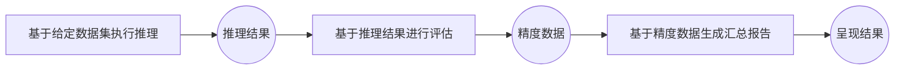
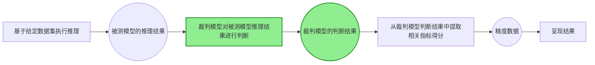
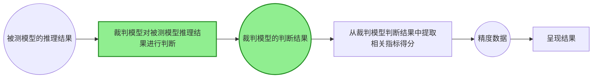
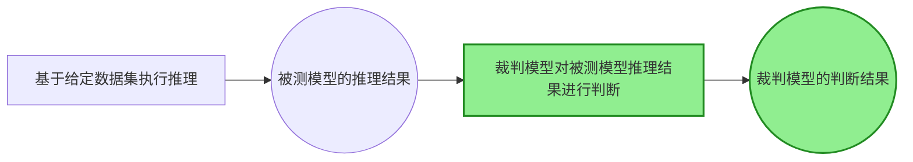
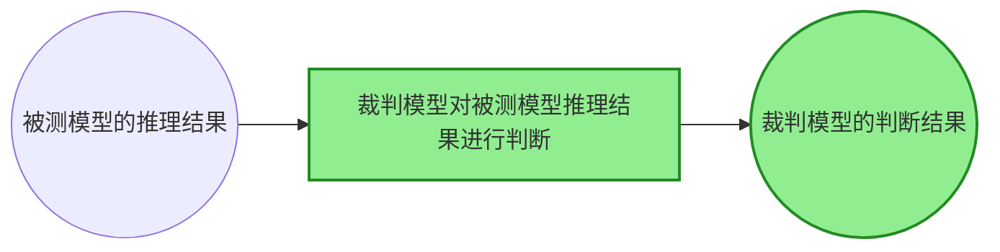

# 使用裁判模型进行测评
## 为什么使用裁判模型进行测评

常规测评任务中，大部分情况下对模型推理结果评估的过程是从推理结果中用正则表达式等方式提取答案，并与标准答案比较，从而判断模型推理结果是否正确，最终计算一个总分。整体流程如下：

然而，有些测评场景中没有标准答案，或者不仅需要判断答案是否正确，还需要评估得出答案的过程是否合理。这种情况下，常规的答案提取方式无法满足需求，因此需要引入裁判模型对被测模型的推理结果进行判断。有裁判模型介入的整体测评流程如下：


## 快速上手
以aime2025数据集评测为例，使能方式与[AISBench工具快速入门](https://ais-bench-benchmark-rf.readthedocs.io/zh-cn/latest/get_started/quick_start.html#)基本一致，快速上手中仅做差异化说明

### 命令含义
AISBench命令中通过`--datasets`指定的裁判模型数据集任务`aime2025_gen_0_shot_llmjudge`。
```shell
ais_bench --models vllm_api_general_chat --datasets aime2025_gen_0_shot_llmjudge
```
> 注：裁判模型数据集任务与常规数据集任务在配置上有差别，两种数据集任务是可以在一条数据集任务中混用的

### 任务含义查询(可选)
与快速入门一致，不赘述

### 运行命令前置准备
- `--models`: 使用`vllm_api_general_chat`模型任务，需要准备支持`v1/chat/completions`子服务的推理服务，可以参考🔗 [VLLM启动OpenAI 兼容服务器](https://docs.vllm.com.cn/en/latest/getting_started/quickstart.html#openai-compatible-server)启动推理服务（被测模型是一个推理服务，裁判模型是另一个推理服务，快速入门如果图方便也可以共用一个服务）
- `--datasets`: 使用`aime2025_gen_0_shot_llmjudge`数据集任务，需要准备aime2025数据集，可以从🔗 [opencompass
提供的aime2025数据集压缩包](http://opencompass.oss-cn-shanghai.aliyuncs.com/datasets/data/aime2025.zip)下载。将解压后的`aime2025/`文件夹部署到AISBench评测工具根路径下的`ais_bench/datasets`文件夹下。

### 任务对应配置文件修改
每个模型任务、数据集任务和结果呈现任务都对应一个配置文件，运行命令前需要修改这些配置文件的内容。这些配置文件路径可以通过在原有AISBench命令基础上加上`--search`来查询，例如：
```shell
ais_bench --models vllm_api_general_chat --datasets aime2025_gen_0_shot_llmjudge --search
```
> ⚠️ **注意**： 执行带search命令会打印出任务对应的配置文件的绝对路径。

执行查询命令可以得到如下查询结果：
```shell
╒══════════════╤═══════════════════════════════════════╤════════════════════════════════════════════════════════════════════════════════════════════════════════════════════════════════╕
│ Task Type    │ Task Name                             │ Config File Path                                                                                                               │
╞══════════════╪═══════════════════════════════════════╪════════════════════════════════════════════════════════════════════════════════════════════════════════════════════════════════╡
│ --models     │ vllm_api_general_chat                 │ /your_workspace/benchmark/ais_bench/benchmark/configs/models/vllm_api/vllm_api_general_chat.py                                 │
├──────────────┼───────────────────────────────────────┼────────────────────────────────────────────────────────────────────────────────────────────────────────────────────────────────┤
│ --datasets   │ aime2025_gen_0_shot_llmjudge          │ /your_workspace/benchmark/ais_bench/benchmark/configs/datasets/aime2025/aime2025_gen_0_shot_llmjudge.py                        │
╘══════════════╧═══════════════════════════════════════╧════════════════════════════════════════════════════════════════════════════════════════════════════════════════════════════════╛

```
- `vllm_api_general_chat`对应被测模型任务的配置文件配置方法与快速入门一致不赘述
- `aime2025_gen_0_shot_llmjudge`对应裁判模型数据集任务的配置文件中需要修改裁判模型的配置：
    ```python
            judge_model=dict(
                attr="service",
                type=VLLMCustomAPIChat,
                abbr="judge",  # abbr 标识裁判模型唯一性
                path="",                    # 指定模型序列化词表文件绝对路径（精度测试场景一般不需要配置）
                model="",        # 指定服务端已加载模型名称，依据实际VLLM推理服务拉取的模型名称配置（配置成空字符串会自动获取）
                stream=False,
                request_rate=0,           # 请求发送频率，每1/request_rate秒发送1个请求给服务端，小于0.1则一次性发送所有请求
                use_timestamp=False,      # 是否按数据集中 timestamp 调度请求，适用于含 timestamp 的数据集（如 Mooncake Trace）
                retry=2,                  # 每个请求最大重试次数
                api_key="",               # 自定义API key，默认是空字符串
                host_ip="localhost",      # 指定裁判模型推理服务的IP
                host_port=8080,           # 指定裁判模型推理服务的端口
                url="",                     # 自定义访问裁判模型推理服务的URL路径(当base url不是http://host_ip:host_port的组合时需要配置，配置后host_ip和host_port将被忽略)
                max_out_len=512,          # 推理服务输出的token的最大数量
                batch_size=1,               # 请求发送的最大并发数
                trust_remote_code=False,    # tokenizer是否信任远程代码，默认False;
                generation_kwargs=dict(   # 模型推理参数，参考VLLM文档配置，AISBench评测工具不做处理，在发送的请求中附带
                    temperature=0.01,
                    ignore_eos=False,
                )
                pred_postprocessor=dict(type=extract_non_reasoning_content),
            ),
    ```
裁判模型任务的配置含义与被测模型任务配置的含义是完全相同的。


### 执行命令
修改好配置文件后，执行命令启动服务化精度评测（基于裁判模型评估）：
```bash
ais_bench --models vllm_api_general_chat --datasets aime2025_gen_0_shot_llmjudge
```
### 查看任务执行细节
全过程进度显示
执行AISBench命令后，正在执行的任务状态会在命令行实时刷新的看板上显示（键盘按"P"键可以停止刷新，用于复制看板信息，再按"P"可以继续刷新），例如：
```shell
Base path of result&log : outputs/default/20260305_153318
Task Progress Table (Updated at: 2026-03-05 15:34:33)
Page: 1/1  Total 2 rows of data
Press Up/Down arrow to page, 'P' to PAUSE/RESUME screen refresh, 'Ctrl + C' to exit
+--------------------------------+-----------+---------------------------------------------------+-------------+----------+-----------------------------------------------+---------------------------------------------------+
| Task Name                      |   Process | Progress                                          | Time Cost   | Status   | Log Path                                      | Extend Parameters                                 |
+================================+===========+===================================================+=============+==========+===============================================+===================================================+
| vllm-api-general-chat/aime2025 |   2818438 | [##############################] 30/30 [2.0 it/s] | 0:00:12     | finish   | logs/infer/vllm-api-general-chat/aime2025.out | {'POST': 30, 'RECV': 30, 'FINISH': 30, 'FAIL': 0} |
+--------------------------------+-----------+---------------------------------------------------+-------------+----------+-----------------------------------------------+---------------------------------------------------+

```
裁判模型推理过程：
```shell
Base path of result&log : outputs/default/20260305_153318
Task Progress Table (Updated at: 2026-03-05 15:34:33)
Page: 1/1  Total 2 rows of data
Press Up/Down arrow to page, 'P' to PAUSE/RESUME screen refresh, 'Ctrl + C' to exit

+--------------------------------------+-----------+---------------------------------------------------+-------------+----------+-----------------------------------------------------+---------------------------------------------------+
| Task Name                            |   Process | Progress                                          | Time Cost   | Status   | Log Path                                            | Extend Parameters                                 |
+======================================+===========+===================================================+=============+==========+=====================================================+===================================================+
| vllm-api-general-chat/aime2025-judge |   2821633 | [##############################] 30/30 [2.0 it/s] | 0:00:58     | finish   | logs/infer/vllm-api-general-chat/aime2025-judge.out | {'POST': 30, 'RECV': 30, 'FINISH': 30, 'FAIL': 0} |
+--------------------------------------+-----------+---------------------------------------------------+-------------+----------+-----------------------------------------------------+---------------------------------------------------+

```
从裁判模型推理结果提取答案过程：
```shell
Base path of result&log : outputs/default/20260305_153318
Task Progress Table (Updated at: 2026-03-05 15:34:33)
Page: 1/1  Total 2 rows of data
Press Up/Down arrow to page, 'P' to PAUSE/RESUME screen refresh, 'Ctrl + C' to exit

+--------------------------------------+-----------+------------+-------------+----------+----------------------------------------------------+---------------------+
| Task Name                            |   Process | Progress   | Time Cost   | Status   | Log Path                                           | Extend Parameters   |
+======================================+===========+============+=============+==========+====================================================+=====================+
| vllm-api-general-chat/aime2025-judge |   2826026 | NA         | 0:00:00     | finish   | logs/eval/vllm-api-general-chat/aime2025-judge.out | None                |
+--------------------------------------+-----------+------------+-------------+----------+----------------------------------------------------+---------------------+

```

任务执行的细节日志会不断落盘在默认的输出路径，这个输出路径在实时刷新的看板上显示，即`Log Path`。`Log Path`（`logs/infer/vllm-api-general-chat/aime2025.out`）是在`Base path`（`outputs/default/20260305_153318`）下的路径，以上述的看板信息为例，任务执行的详细日志路径为：
```shell
# {Base path}/{Log Path}
# 被测模型推理过程日志
outputs/default/20260305_153318/logs/infer/vllm-api-general-chat/aime2025.out
# 裁判模型推理过程日志
outputs/default/20260305_153318/logs/infer/vllm-api-general-chat/aime2025-judge.out
# 从裁判模型推理结果提取答案过程日志
outputs/default/20260305_153318/logs/eval/vllm-api-general-chat/aime2025-judge.out
```

> 💡 如果希望执行过程中将详细日志直接打印，执行命令时可以加上 `--debug`:
`ais_bench --models vllm_api_general_chat --datasets aime2025_gen_0_shot_llmjudge --debug`


`Base path`（`outputs/default/20260305_153318`）下包含了所有任务的执行细节，命令执行结束后所有的执行细节如下：
```shell
20260305_153318/
├── configs # 模型任务、数据集任务和结构呈现任务对应的配置文件合成的一个配置
│   └── 20260305_153318_2833762.py
├── logs # 执行过程中日志，命令中如果加--debug，不会有过程日志落盘（都直接打印出来了）
│   ├── eval
│   │   └── vllm-api-general-chat
│   │       └── aime2025-judge.out # 基于predictions/文件夹下的裁判模型推理结果的精度评测过程的日志
│   └── infer
│       └── vllm-api-general-chat
│           ├── aime2025-judge.out # 裁判模型推理结果
│           └── aime2025.out # 被测模型推理过程日志
├── predictions
│   └── vllm-api-general-chat
│       ├── aime2025.jsonl # 被测模型推理结果
│       └── aime2025-judge.jsonl # 裁判模型推理结果（推理服务返回的所有输出）
├── results
│   └── vllm-api-general-chat
│       └── aime2025-judge.json # 精度评测计算的原始分数
└── summary
    ├── summary_20260305_153318.csv # 最终精度分数呈现（表格格式）
    ├── summary_20260305_153318.md # 最终精度分数呈现（markdown格式）
    └── summary_20260305_153318.txt # # 最终精度分数呈现（文本格式）
```
> ⚠️ **注意**： 不同评测场景落盘任务执行细节内容不同，具体请参考具体评测场景的指南。


### 输出结果
结果显示的示例如下
```bash
| dataset | version | metric | mode | vllm-api-general-chat |
|----- | ----- | ----- | ----- | -----|
| aime2025-judge | 3fb7e8 | accuracy | gen | 100.00 |
```

## 其他精度评测功能场景
从裁判模型的快速上手章节可以看到，除了需要额外修改数据配置文件中裁判模型的配置，其他测评执行方式是与常规测评执行方式是完全一致的，因此其他精度评测功能场景的执行方式也是完全一致的。
### 多任务测评
参考[精度评测场景多任务测评](../base_tutorials/scenes_intro/accuracy_benchmark.md#多任务测评)
### 多任务并行测评
参考[精度评测场景多任务并行测评](../base_tutorials/scenes_intro/accuracy_benchmark.md#多任务并行测评)
### 中断续测 & 失败用例重测
参考[精度评测场景中断续测 & 失败用例重测](../base_tutorials/scenes_intro/accuracy_benchmark.md#中断续测-失败用例重测)
> ⚠️ 注意，--reuse 重新补全被测模型推理结果后，裁判模型会从0开始重新对全部完整的推理结果进行判断，历史判断过的结果将不会使用。
### 合并子数据集推理
参考[精度评测场景合并子数据集推理](../base_tutorials/scenes_intro/accuracy_benchmark.md#合并子数据集推理)
### 固定请求数测评
参考[精度评测场景固定请求数测评](../base_tutorials/scenes_intro/accuracy_benchmark.md#固定请求数测评)
### 多次独立重复推理
参考[精度评测场景多次独立重复推理](../base_tutorials/scenes_intro/accuracy_benchmark.md#多次独立重复推理)
> ⚠️ 这个场景需要注意，仅需要在被测模型中配置多次独立重复推理的参数，在裁判模型的配置中无需配置。
### 推理结果重评估
参考[精度评测场景推理结果重评估](../base_tutorials/scenes_intro/accuracy_benchmark.md#推理结果重评估)

> ⚠️ 这个场景需要注意重评估是从裁判模型推理开始的

> 默认情况下如果存在裁判模型的推理结果，会跳过裁判模型重新推理的过程，直接从裁判模型推理结果中提取相关指标得分。
> 如果希望裁判模型重新推理。需要手动删除`predictions/`文件夹下的裁判模型推理结果文件`aime2025-judge.jsonl`，然后重新执行命令。

## 其他运行模式拓展
在[默认几种运行模式](../base_tutorials/all_params/mode.md)的基础上，还提供了其他几种运行模式。
### 仅完成裁判模型推理结果的输出
通过`--mode infer_judge`实现仅完成从被测模型推理到裁判模型推理结果的输出，不进行指标提取。

```bash
ais_bench --models vllm_api_general_chat --datasets aime2025_gen_0_shot_llmjudge --mode infer_judge
```


### 基于被测模型推理结果仅做推理
通过`--mode judge`实现基于被测模型推理结果，仅完成裁判模型的推理，不进行指标提取(如果存在裁判模型的推理结果，会跳过裁判模型重新推理的过程)。
```bash
ais_bench --models vllm_api_general_chat --datasets aime2025_gen_0_shot_llmjudge --reuse 20260305_153318 --mode judge
```


